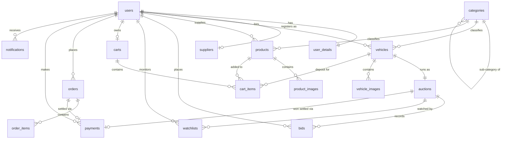

# A&C Japan Auto Parts - Entities and Database Schema Documentation

This document defines the complete relational database schema, entities, relationships, constraints, and mappings required to support all functionality across the **A&C Japan Auto Parts** system (Spring Boot REST API + Frontend).

---

## 1. Domain Entities & Roles Overview

| Domain | Entity | Description | Supported Frontend Pages & Functions |
| :--- | :--- | :--- | :--- |
| **Identity & Access** | `User` | Core system credentials, roles, and account statuses. | `login.html`, `app.js` (JWT authentication, role guards) |
| | `UserDetails` | Detailed customer/supplier profile and preferences. | `profile.html` (Profile Dashboard, Settings) |
| | `Supplier` | Business registration, documents, and approval status. | `profile.html` (Become Supplier), `admin.html` (Approve/Reject) |
| **Catalog & Categorization** | `Category` | Hierarchical categories (Vehicle and Spare Part taxonomy). | `buy-now.html`, `admin.html`, category tree filters |
| **Vehicles & Auctions** | `Vehicle` | Vehicle specifications, condition, history, and status. | `add-auction.html`, `listing.html`, `auction-details.html` |
| | `VehicleImage` | Gallery images and primary photo for vehicles. | `add-auction.html`, `auction-details.html` carousel |
| | `Auction` | Live auction parameters, timers, reserve prices, status. | `auction-details.html`, `listing.html`, `supplier-dashboard.html` |
| | `Bid` | Bidding ledger tracking each placed bid and timestamp. | `auction-details.html` (Live Bidding, Recent Bidders) |
| | `Watchlist` | User saved auctions list. | `profile.html` (Wishlist tab), `listing.html` |
| **Spare Parts E-Commerce** | `Product` | Direct buy-now spare parts inventory, pricing, SKU. | `buy-now.html`, `supplier-dashboard.html` |
| | `ProductImage` | Gallery images for spare parts. | `buy-now.html` product detail modal |
| **Cart & Ordering** | `Cart` | User's active shopping cart session. | `cart.html`, topbar cart badge |
| | `CartItem` | Individual parts or vehicle deposits in cart. | `cart.html` (quantity adjustment, subtotal) |
| | `Order` | Finalized customer orders and checkout records. | `cart.html` (Checkout), `profile.html` (Order History) |
| | `OrderItem` | Specific line items belonging to an order. | `cart.html`, order invoice breakdowns |
| | `Payment` | Payment transactions (Stripe/PayPal/Cards). | `cart.html`, payment status tracking |
| **System Alerts** | `Notification` | System and transactional user notifications. | Topbar notification bell, outbid / order alerts |

---

## 2. Relational Database Schema (SQL DDL)

### 2.1. Users & Authentication

```sql
-- Core user accounts
CREATE TABLE users (
    user_id BIGINT AUTO_INCREMENT PRIMARY KEY,
    user_string_id VARCHAR(50) UNIQUE NOT NULL,                -- e.g. "USR-0001"
    user_name VARCHAR(100) NOT NULL,
    user_email VARCHAR(150) UNIQUE NOT NULL,
    user_password VARCHAR(255) NOT NULL,                       -- BCrypt hashed password
    user_role ENUM('CUSTOMER', 'SUPPLIER', 'ADMIN') NOT NULL DEFAULT 'CUSTOMER',
    user_status ENUM('ACTIVE', 'SUSPENDED', 'PENDING_VERIFICATION') NOT NULL DEFAULT 'ACTIVE',
    is_verified BOOLEAN NOT NULL DEFAULT FALSE,
    created_at TIMESTAMP DEFAULT CURRENT_TIMESTAMP,
    updated_at TIMESTAMP DEFAULT CURRENT_TIMESTAMP ON UPDATE CURRENT_TIMESTAMP
);

-- User profile details
CREATE TABLE user_details (
    detail_id BIGINT AUTO_INCREMENT PRIMARY KEY,
    user_id BIGINT NOT NULL UNIQUE,
    user_phone VARCHAR(25),
    user_address TEXT,
    city VARCHAR(100),
    state VARCHAR(100),
    country VARCHAR(100) DEFAULT 'Japan',
    zip_code VARCHAR(20),
    avatar_url VARCHAR(255),
    preferred_currency VARCHAR(10) DEFAULT 'USD',              -- USD, JPY
    preferred_language VARCHAR(10) DEFAULT 'en',              -- en, ja
    order_update_notifications BOOLEAN DEFAULT TRUE,
    bid_alert_notifications BOOLEAN DEFAULT TRUE,
    FOREIGN KEY (user_id) REFERENCES users(user_id) ON DELETE CASCADE
);

-- Supplier applications and store verification
CREATE TABLE suppliers (
    supplier_id BIGINT AUTO_INCREMENT PRIMARY KEY,
    user_id BIGINT NOT NULL UNIQUE,
    business_name VARCHAR(150) NOT NULL,
    business_address TEXT NOT NULL,
    contact_person VARCHAR(100) NOT NULL,
    phone_number VARCHAR(25) NOT NULL,
    registration_doc_url VARCHAR(500) NOT NULL,                -- PDF document path
    supplier_status ENUM('PENDING', 'APPROVED', 'REJECTED') NOT NULL DEFAULT 'PENDING',
    rejection_reason TEXT NULL,
    approved_by BIGINT NULL,                                   -- Admin user_id
    approved_at TIMESTAMP NULL,
    created_at TIMESTAMP DEFAULT CURRENT_TIMESTAMP,
    FOREIGN KEY (user_id) REFERENCES users(user_id) ON DELETE CASCADE,
    FOREIGN KEY (approved_by) REFERENCES users(user_id) ON DELETE SET NULL
);
```

---

### 2.2. Categories

```sql
-- Hierarchical category taxonomy
CREATE TABLE categories (
    category_id BIGINT AUTO_INCREMENT PRIMARY KEY,
    category_name VARCHAR(100) NOT NULL,
    category_slug VARCHAR(120) UNIQUE NOT NULL,
    parent_id BIGINT NULL,                                     -- Parent category for sub-trees
    type ENUM('VEHICLE', 'PART') NOT NULL,
    description TEXT,
    icon_class VARCHAR(50),                                    -- FontAwesome icon class
    is_active BOOLEAN DEFAULT TRUE,
    FOREIGN KEY (parent_id) REFERENCES categories(category_id) ON DELETE CASCADE
);
```

---

### 2.3. Vehicles & Auctions

```sql
-- Vehicles listed for auction or direct sale
CREATE TABLE vehicles (
    vehicle_id BIGINT AUTO_INCREMENT PRIMARY KEY,
    user_id BIGINT NOT NULL,                                   -- Seller / Supplier
    category_id BIGINT NULL,
    title VARCHAR(200) NOT NULL,
    brand VARCHAR(80) NOT NULL,
    model VARCHAR(80) NOT NULL,
    year INT NOT NULL,
    mileage INT NOT NULL,                                      -- Mileage count
    price DECIMAL(12, 2) NOT NULL,
    currency VARCHAR(10) DEFAULT 'USD',
    vehicle_condition ENUM('NEW', 'USED', 'CERTIFIED') NOT NULL DEFAULT 'USED',
    transmission ENUM('AUTOMATIC', 'MANUAL', 'CVT') NOT NULL DEFAULT 'AUTOMATIC',
    fuel_type ENUM('GASOLINE', 'DIESEL', 'HYBRID', 'ELECTRIC') NOT NULL DEFAULT 'GASOLINE',
    engine_size VARCHAR(50),                                   -- e.g. "6.2L V8"
    engine_power VARCHAR(50),
    exterior_color VARCHAR(50),
    interior_color VARCHAR(50),
    doors INT DEFAULT 4,
    seats INT DEFAULT 5,
    drivetrain ENUM('FWD', 'RWD', 'AWD', '4WD') DEFAULT 'FWD',
    vin VARCHAR(50),
    license_plate VARCHAR(50),
    location_address VARCHAR(255),
    location_city VARCHAR(100),
    location_country VARCHAR(100) DEFAULT 'Japan',
    description TEXT,
    status ENUM('PENDING', 'APPROVED', 'REJECTED', 'ACTIVE', 'SOLD') DEFAULT 'PENDING',
    inspection_date DATE,
    inspection_result VARCHAR(100),
    views INT DEFAULT 0,
    created_at TIMESTAMP DEFAULT CURRENT_TIMESTAMP,
    updated_at TIMESTAMP DEFAULT CURRENT_TIMESTAMP ON UPDATE CURRENT_TIMESTAMP,
    FOREIGN KEY (user_id) REFERENCES users(user_id) ON DELETE CASCADE,
    FOREIGN KEY (category_id) REFERENCES categories(category_id) ON DELETE SET NULL
);

-- Gallery photos for vehicles
CREATE TABLE vehicle_images (
    image_id BIGINT AUTO_INCREMENT PRIMARY KEY,
    vehicle_id BIGINT NOT NULL,
    image_url VARCHAR(500) NOT NULL,
    is_primary BOOLEAN DEFAULT FALSE,
    display_order INT DEFAULT 0,
    FOREIGN KEY (vehicle_id) REFERENCES vehicles(vehicle_id) ON DELETE CASCADE
);

-- Auction rules and timing
CREATE TABLE auctions (
    auction_id BIGINT AUTO_INCREMENT PRIMARY KEY,
    vehicle_id BIGINT NOT NULL UNIQUE,
    seller_id BIGINT NOT NULL,
    title VARCHAR(255) NOT NULL,
    auction_type ENUM('VEHICLE', 'PARTS', 'COLLECTIBLE') DEFAULT 'VEHICLE',
    starting_price DECIMAL(12, 2) NOT NULL,
    reserve_price DECIMAL(12, 2) NULL,
    current_bid DECIMAL(12, 2) DEFAULT 0.00,
    min_bid_increment DECIMAL(10, 2) DEFAULT 100.00,
    buy_it_now_price DECIMAL(12, 2) NULL,
    start_date DATETIME NOT NULL,
    end_date DATETIME NOT NULL,
    extended_end_date DATETIME NULL,
    auto_extend_enabled BOOLEAN DEFAULT TRUE,
    auto_extend_minutes INT DEFAULT 10,
    status ENUM('SCHEDULED', 'ACTIVE', 'ENDED', 'CANCELLED') DEFAULT 'SCHEDULED',
    highest_bidder_id BIGINT NULL,
    bid_count INT DEFAULT 0,
    bidder_count INT DEFAULT 0,
    views INT DEFAULT 0,
    is_approved BOOLEAN DEFAULT FALSE,
    is_featured BOOLEAN DEFAULT FALSE,
    created_at TIMESTAMP DEFAULT CURRENT_TIMESTAMP,
    updated_at TIMESTAMP DEFAULT CURRENT_TIMESTAMP ON UPDATE CURRENT_TIMESTAMP,
    FOREIGN KEY (vehicle_id) REFERENCES vehicles(vehicle_id) ON DELETE CASCADE,
    FOREIGN KEY (seller_id) REFERENCES users(user_id) ON DELETE CASCADE,
    FOREIGN KEY (highest_bidder_id) REFERENCES users(user_id) ON DELETE SET NULL
);

-- Bid transaction log
CREATE TABLE bids (
    bid_id BIGINT AUTO_INCREMENT PRIMARY KEY,
    auction_id BIGINT NOT NULL,
    user_id BIGINT NOT NULL,                                   -- Bidder
    bid_amount DECIMAL(12, 2) NOT NULL,
    bid_status ENUM('ACTIVE', 'OUTBID', 'WINNING', 'CANCELLED') DEFAULT 'ACTIVE',
    placed_at TIMESTAMP DEFAULT CURRENT_TIMESTAMP,
    FOREIGN KEY (auction_id) REFERENCES auctions(auction_id) ON DELETE CASCADE,
    FOREIGN KEY (user_id) REFERENCES users(user_id) ON DELETE CASCADE
);

-- User watchlists
CREATE TABLE watchlists (
    watchlist_id BIGINT AUTO_INCREMENT PRIMARY KEY,
    user_id BIGINT NOT NULL,
    auction_id BIGINT NOT NULL,
    created_at TIMESTAMP DEFAULT CURRENT_TIMESTAMP,
    UNIQUE KEY uq_user_auction (user_id, auction_id),
    FOREIGN KEY (user_id) REFERENCES users(user_id) ON DELETE CASCADE,
    FOREIGN KEY (auction_id) REFERENCES auctions(auction_id) ON DELETE CASCADE
);
```

---

### 2.4. Products (Spare Parts)

```sql
-- Direct purchase spare parts inventory
CREATE TABLE products (
    product_id BIGINT AUTO_INCREMENT PRIMARY KEY,
    supplier_id BIGINT NOT NULL,
    category_id BIGINT NOT NULL,
    product_name VARCHAR(200) NOT NULL,
    sku VARCHAR(80) UNIQUE NOT NULL,                           -- e.g. "BR-CP883"
    brand VARCHAR(80) NOT NULL,
    compatible_model VARCHAR(100),
    description TEXT,
    price DECIMAL(10, 2) NOT NULL,
    stock_quantity INT NOT NULL DEFAULT 0,
    quality_type ENUM('BRAND_NEW', 'OEM', 'AFTERMARKET', 'USED_REFURBISHED') DEFAULT 'BRAND_NEW',
    is_featured BOOLEAN DEFAULT FALSE,
    is_active BOOLEAN DEFAULT TRUE,
    created_at TIMESTAMP DEFAULT CURRENT_TIMESTAMP,
    updated_at TIMESTAMP DEFAULT CURRENT_TIMESTAMP ON UPDATE CURRENT_TIMESTAMP,
    FOREIGN KEY (supplier_id) REFERENCES users(user_id) ON DELETE CASCADE,
    FOREIGN KEY (category_id) REFERENCES categories(category_id) ON DELETE RESTRICT
);

-- Spare parts gallery images
CREATE TABLE product_images (
    image_id BIGINT AUTO_INCREMENT PRIMARY KEY,
    product_id BIGINT NOT NULL,
    image_url VARCHAR(500) NOT NULL,
    is_primary BOOLEAN DEFAULT FALSE,
    FOREIGN KEY (product_id) REFERENCES products(product_id) ON DELETE CASCADE
);
```

---

### 2.5. Cart, Orders & Payments

```sql
-- Active user shopping carts
CREATE TABLE carts (
    cart_id BIGINT AUTO_INCREMENT PRIMARY KEY,
    user_id BIGINT NOT NULL UNIQUE,
    updated_at TIMESTAMP DEFAULT CURRENT_TIMESTAMP ON UPDATE CURRENT_TIMESTAMP,
    FOREIGN KEY (user_id) REFERENCES users(user_id) ON DELETE CASCADE
);

-- Line items inside user carts
CREATE TABLE cart_items (
    cart_item_id BIGINT AUTO_INCREMENT PRIMARY KEY,
    cart_id BIGINT NOT NULL,
    product_id BIGINT NULL,                                    -- Set for spare parts
    vehicle_id BIGINT NULL,                                    -- Set for vehicle deposit
    quantity INT NOT NULL DEFAULT 1,
    unit_price DECIMAL(10, 2) NOT NULL,
    added_at TIMESTAMP DEFAULT CURRENT_TIMESTAMP,
    FOREIGN KEY (cart_id) REFERENCES carts(cart_id) ON DELETE CASCADE,
    FOREIGN KEY (product_id) REFERENCES products(product_id) ON DELETE CASCADE,
    FOREIGN KEY (vehicle_id) REFERENCES vehicles(vehicle_id) ON DELETE CASCADE
);

-- Checkout orders
CREATE TABLE orders (
    order_id BIGINT AUTO_INCREMENT PRIMARY KEY,
    order_number VARCHAR(50) UNIQUE NOT NULL,                  -- e.g. "ORD-2026-8491"
    user_id BIGINT NOT NULL,
    subtotal DECIMAL(12, 2) NOT NULL,
    shipping_cost DECIMAL(10, 2) DEFAULT 0.00,
    tax_amount DECIMAL(10, 2) DEFAULT 0.00,
    total_amount DECIMAL(12, 2) NOT NULL,
    promo_code VARCHAR(30) NULL,
    order_status ENUM('PENDING', 'PROCESSING', 'SHIPPED', 'DELIVERED', 'CANCELLED') DEFAULT 'PENDING',
    shipping_recipient_name VARCHAR(100) NOT NULL,
    shipping_phone VARCHAR(25) NOT NULL,
    shipping_address TEXT NOT NULL,
    created_at TIMESTAMP DEFAULT CURRENT_TIMESTAMP,
    updated_at TIMESTAMP DEFAULT CURRENT_TIMESTAMP ON UPDATE CURRENT_TIMESTAMP,
    FOREIGN KEY (user_id) REFERENCES users(user_id) ON DELETE RESTRICT
);

-- Order line items
CREATE TABLE order_items (
    order_item_id BIGINT AUTO_INCREMENT PRIMARY KEY,
    order_id BIGINT NOT NULL,
    product_id BIGINT NULL,
    vehicle_id BIGINT NULL,
    item_type ENUM('PART', 'VEHICLE_DEPOSIT', 'VEHICLE_FULL') NOT NULL,
    item_title VARCHAR(200) NOT NULL,
    quantity INT NOT NULL DEFAULT 1,
    unit_price DECIMAL(12, 2) NOT NULL,
    total_price DECIMAL(12, 2) NOT NULL,
    FOREIGN KEY (order_id) REFERENCES orders(order_id) ON DELETE CASCADE,
    FOREIGN KEY (product_id) REFERENCES products(product_id) ON DELETE SET NULL,
    FOREIGN KEY (vehicle_id) REFERENCES vehicles(vehicle_id) ON DELETE SET NULL
);

-- Financial payment transactions
CREATE TABLE payments (
    payment_id BIGINT AUTO_INCREMENT PRIMARY KEY,
    order_id BIGINT NULL,
    auction_id BIGINT NULL,
    user_id BIGINT NOT NULL,
    transaction_id VARCHAR(100) UNIQUE NOT NULL,               -- Gateway transaction ID
    payment_method ENUM('CREDIT_CARD', 'PAYPAL', 'STRIPE', 'BANK_TRANSFER') NOT NULL,
    amount DECIMAL(12, 2) NOT NULL,
    currency VARCHAR(10) DEFAULT 'USD',
    payment_status ENUM('PENDING', 'COMPLETED', 'FAILED', 'REFUNDED') DEFAULT 'PENDING',
    payment_session_id VARCHAR(150),
    paid_at TIMESTAMP NULL,
    created_at TIMESTAMP DEFAULT CURRENT_TIMESTAMP,
    FOREIGN KEY (order_id) REFERENCES orders(order_id) ON DELETE SET NULL,
    FOREIGN KEY (auction_id) REFERENCES auctions(auction_id) ON DELETE SET NULL,
    FOREIGN KEY (user_id) REFERENCES users(user_id) ON DELETE RESTRICT
);
```

---

### 2.6. Notifications

```sql
-- User alerts & messaging
CREATE TABLE notifications (
    notification_id BIGINT AUTO_INCREMENT PRIMARY KEY,
    user_id BIGINT NOT NULL,
    title VARCHAR(150) NOT NULL,
    message TEXT NOT NULL,
    type ENUM('OUTBID', 'AUCTION_WON', 'ORDER_STATUS', 'SUPPLIER_APPROVED', 'SUPPLIER_REJECTED', 'SYSTEM') NOT NULL,
    related_entity_type VARCHAR(50),                           -- e.g. 'AUCTION', 'ORDER'
    related_entity_id BIGINT,
    is_read BOOLEAN DEFAULT FALSE,
    created_at TIMESTAMP DEFAULT CURRENT_TIMESTAMP,
    FOREIGN KEY (user_id) REFERENCES users(user_id) ON DELETE CASCADE
);
```

---

## 3. Entity-Relationship (ER) Diagram



---

## 4. Frontend Route to Database Table Matrix

| Action / Feature | Frontend Path | Method & API Endpoint | Impacted Tables |
| :--- | :--- | :--- | :--- |
| **Register User** | `login.html` | `POST /api/v1/users/register` | `users`, `user_details` |
| **Login (JWT)** | `login.html` | `POST /api/v1/auth/login` | `users` |
| **Load User Profile** | `profile.html` | `GET /api/v1/users/get/{id}` | `users`, `user_details` |
| **Update Profile** | `profile.html` | `PUT /api/v1/users/profile/update` | `user_details` |
| **Become Supplier** | `profile.html` | `POST /api/v1/users/{id}/become-supplier` | `suppliers` |
| **Admin Moderation** | `admin.html` | `PUT /api/v1/admin/users/{id}/approve-supplier`<br>`PUT /api/v1/admin/auctions/{id}/approve` | `suppliers`, `users`, `auctions`, `vehicles` |
| **Create Auction Listing** | `add-auction.html` | `POST /api/v1/vehicles`<br>`POST /api/v1/auctions` | `vehicles`, `vehicle_images`, `auctions` |
| **Browse Auctions** | `listing.html` | `GET /api/v1/auctions/active` | `auctions`, `vehicles`, `vehicle_images` |
| **Place Live Bid** | `auction-details.html` | `POST /api/v1/auctions/{id}/bids` | `bids`, `auctions`, `notifications` |
| **Toggle Watchlist** | `listing.html`, `auction-details.html` | `POST /api/v1/auctions/{id}/watch` | `watchlists` |
| **Browse Spare Parts** | `buy-now.html` | `GET /api/v1/products`<br>`GET /api/v1/products/filter` | `products`, `product_images`, `categories` |
| **Cart Operations** | `cart.html` | `GET /api/v1/cart`<br>`POST /api/v1/cart/add`<br>`PUT /api/v1/cart/update` | `carts`, `cart_items`, `products`, `vehicles` |
| **Checkout & Pay** | `cart.html` | `POST /api/v1/orders`<br>`POST /api/v1/payment/create-session` | `orders`, `order_items`, `payments`, `carts` |
| **Order History** | `profile.html` | `GET /api/v1/orders/user` | `orders`, `order_items` |
| **Notifications** | Topbar / Nav | `GET /api/v1/notifications` | `notifications` |
